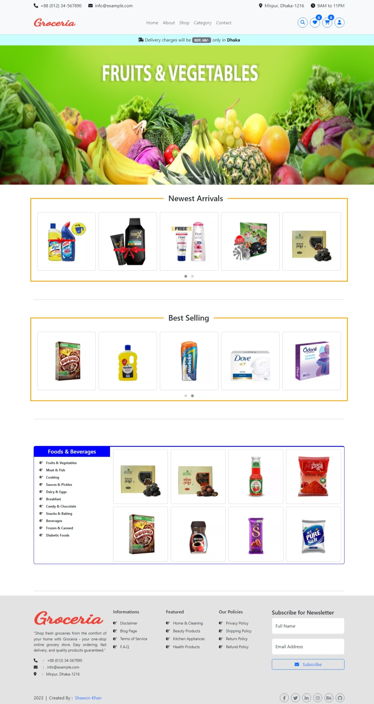
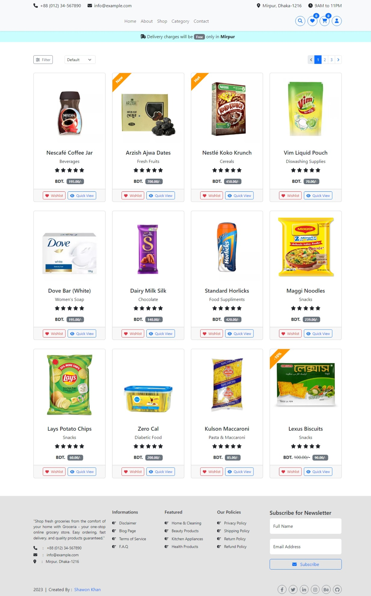
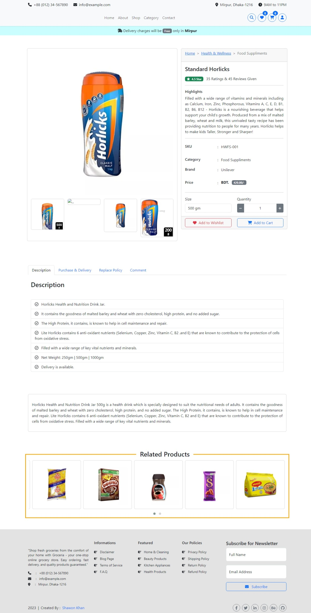
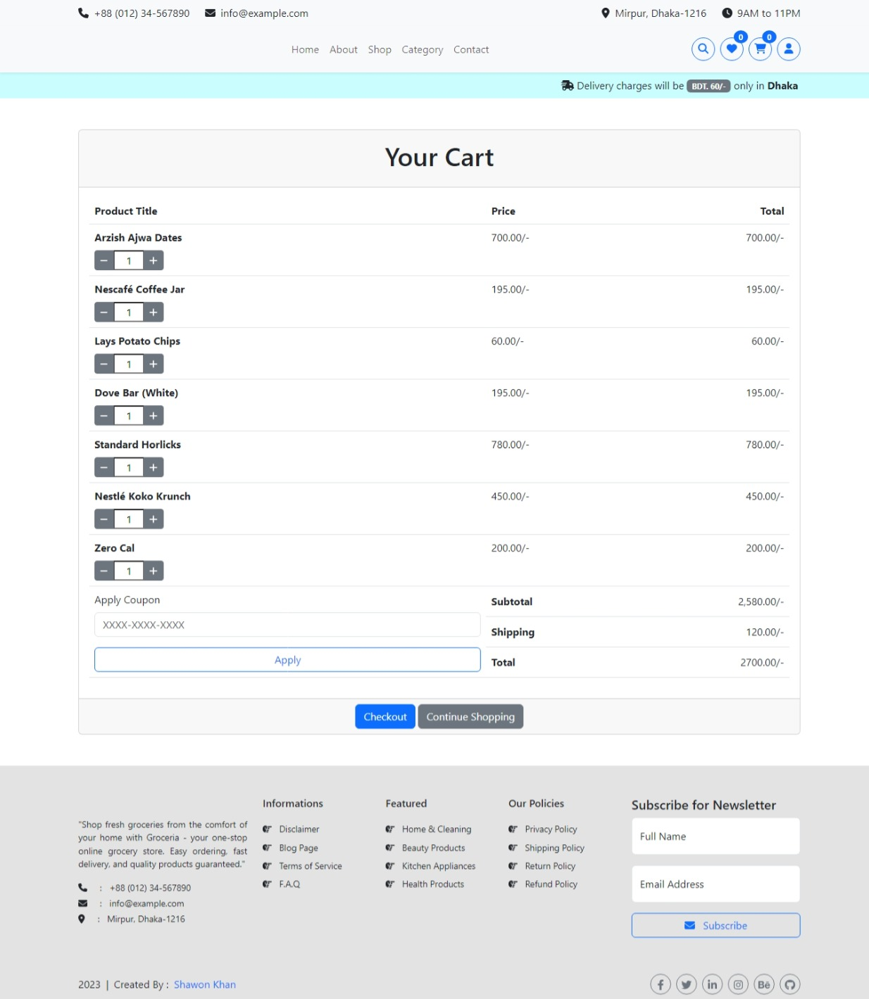
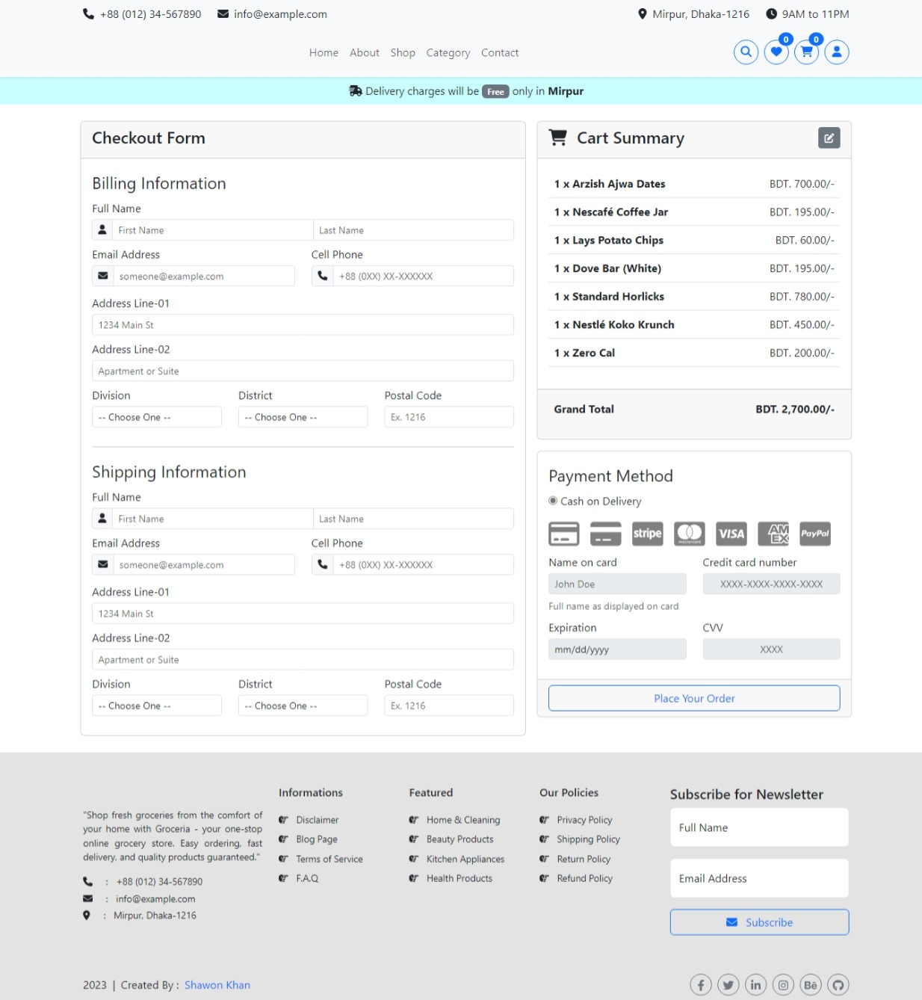
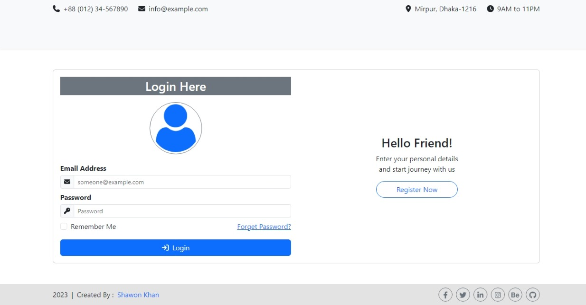
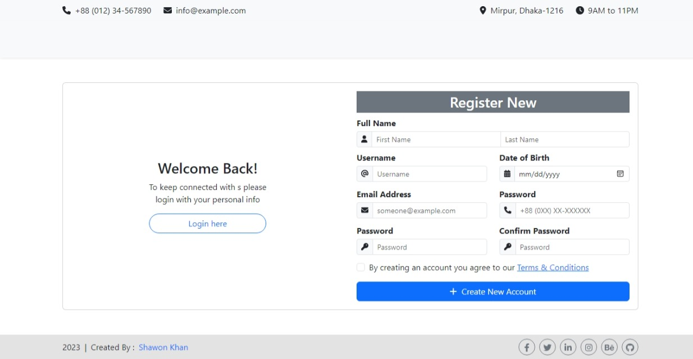

# Groceria - Multi-Page Grocery Shop UI 

Explore this Multi-Page Grocery Shop UI GitHub repository—an extensive web interface for a virtual grocery store with multiple interconnected pages. This project showcases the synergy of HTML, CSS, Bootstrap, JavaScript, jQuery, and SASS to deliver a comprehensive and engaging shopping experience.

## Live Preview
To preview this project please visit https://demo.shawon-khan.com/grocery-shop/

## User Interface

## Technologies Used

The following technologies have been used in the creation of this UI:

- **[Bootstrap](https://getbootstrap.com/)** : A CSS framework for creating responsive and attractive UI components.
- **[FontAwesome](https://fontawesome.com/)**: A popular icon library that provides a wide range of icons for web projects.

## Key Features

- **Responsive Design**: The Grocery Shop UI offers a seamless user experience across devices, with each page designed to adapt effortlessly to various screen sizes.

- **Bootstrap-Powered Layout**: Built on Bootstrap, the user interface boasts a consistent, user-friendly layout with responsive elements, ensuring easy navigation and a cohesive design.

- **Interactive Shopping Experience**: JavaScript and jQuery enhance the user interface with interactive features, including product filtering, real-time cart updates, and a user-friendly checkout process.

- **Customizable Styling with SASS**: Harness the power of SASS for organized and easily customizable styles, empowering you to personalize colors, typography, and design elements to align with your brand.

- **Multi-Page Structure**: This repository includes multiple pages such as Home, About Us, Shop, Product Display, Cart, Checkout, Login, Register, Privacy Policy, Terms and Conditions, Blog, and more, creating a comprehensive web presence for your grocery shop.

- **Product Catalog**: Showcase products with detailed descriptions, pricing, and images, providing an immersive shopping experience for customers.

- **Shopping Cart**: Enable customers to add, manage, and review items in their cart before proceeding to checkout.

- **User-Friendly Navigation**: Smooth page transitions, clear categorization, and an intuitive menu make navigating the grocery shop effortless.

Whether you're establishing an online grocery store or expanding an existing e-commerce venture, our Multi-Page Grocery Shop UI GitHub repository is a valuable resource. Fork it, tailor it to your unique requirements, and create a compelling online shopping platform with a variety of pages to serve your customers' needs effectively.

## License

`Groceria - Multi-Page Grocery Shop UI` is licensed under the `GNU General Public License version 3.0 (GPL-3.0)`. You can find the full text of the license in the `LICENSE` file.

## Author

`Groceria - Multi-Page Grocery Shop UI` is designed and maintained by **[Muhammad Nasir Uddin Khan Shawon](https://www.shawon-khan.com/)**. You can find more about me on my [GitHub profile](https://github.com/shawonk007). Feel free to reach out via email at `shawonk007@gmail.com` or connect with me on **[LinkedIn](https://www.linkedin.com/in/shawonkhan007)**.